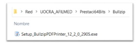
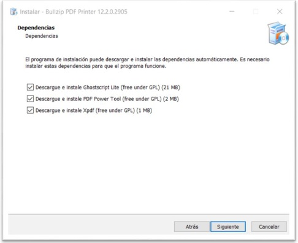
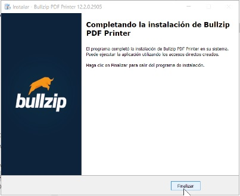
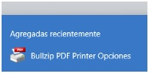
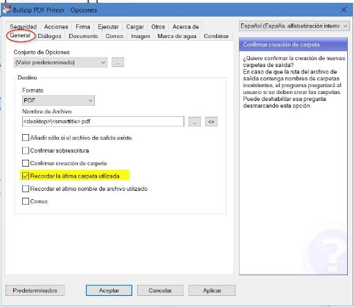
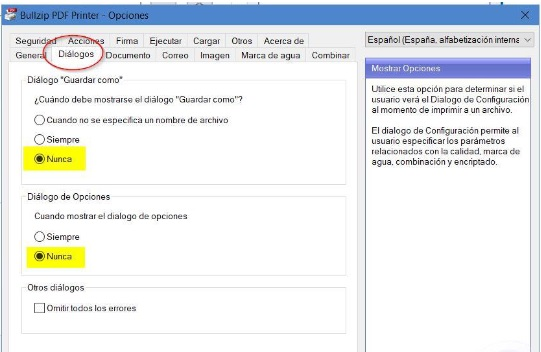
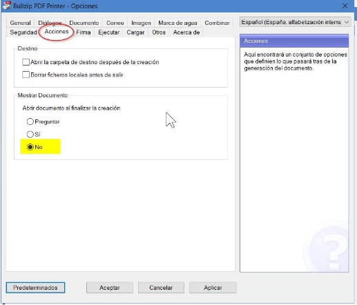
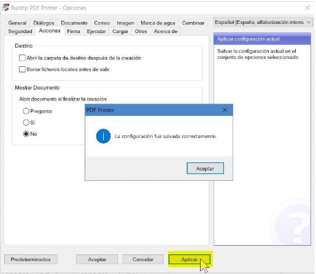

## **Apertura PDF**

Instalación de impresóra pdf Bullzip

**Descripción breve del proceso:**

Se instala esta aplicacion para poder generar los PDF para exportar a SAP.

## Documentación Técnica

Los usuarios de Presmed que estén afectados a la exportación de expedientes para SAP, deberán tener instalado y configurado este programa.

1. El instalador se ha descargado en la carpeta 

\\UOCRA_AFILMED\Prestaci64Bits\Bullzip

2. se pude descargar del sitio https://www.bullzip.com/products/pdf/download.php, la versión Community Edition.

3. Realizar la instalación por defecto, y en la instancia de Dependencias, descargar todas.

4. Completar la instalación yproceder a la configuración.

Configuración de las OPCIONES de BullzipTerminada la instalación proceder a configurar las opciones de Bullzip. Acceder desde el menúde inicio a

1. En la pestaña General, sólo dejar seleccionada la opción “Recordarla última carpeta utilizada”

2. En la pestaña Diálogos:

3. En la pestaña Acciones, sólo dejar seleccionada la opción “Recordarla última carpeta utilizada”

Concluir con “Aplicar”y “Aceptar”

