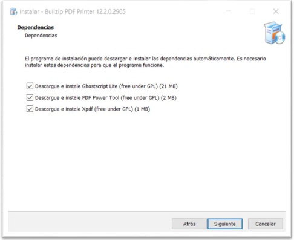

## **Apertura PDF**

Cambiar aplicacion "PDF" predeterminada. Por defecto esta asignada el navegador "EDGE" por lo cual hay que predeterminar "AdobeAcrobatReaderDC".

**Descripción breve del proceso:**

Problema de la vista de documentos mediante la transacción FB02 en SAP. 

## Documentación Técnica

Por default cualquier perfil de usuario de Windows 10 tiene por defecto la apertura de los archivos PDF por el navegador predeterminado, en este caso el Microsoft Edge.
Y lo más recomendable es predeterminar que el archivo .PDF sea abierto en forma automática por el Acrobat Reader de la siguiente forma:

En el perfil de la persona a configurar seleccionar un archivo PDF luego presionar el botón Propiedades y luego seleccionar botón Cambiar 

2. se pude descargar del sitio https://www.bullzip.com/products/pdf/download.php, la versión Community Edition.

3. Realizar la instalación por defecto, y en la instancia de Dependencias, descargar todas.

4. Completar la instalación yproceder a la configuración.

Configuración de las OPCIONES de BullzipTerminada la instalación proceder a configurar las opciones de Bullzip. Acceder desde el menúde inicio a

1. En la pestaña General, sólo dejar seleccionada la opción “Recordarla última carpeta utilizada”

2. En la pestaña Diálogos:

3. En la pestaña Acciones, sólo dejar seleccionada la opción “Recordarla última carpeta utilizada”

Concluir con “Aplicar”y “Aceptar”

