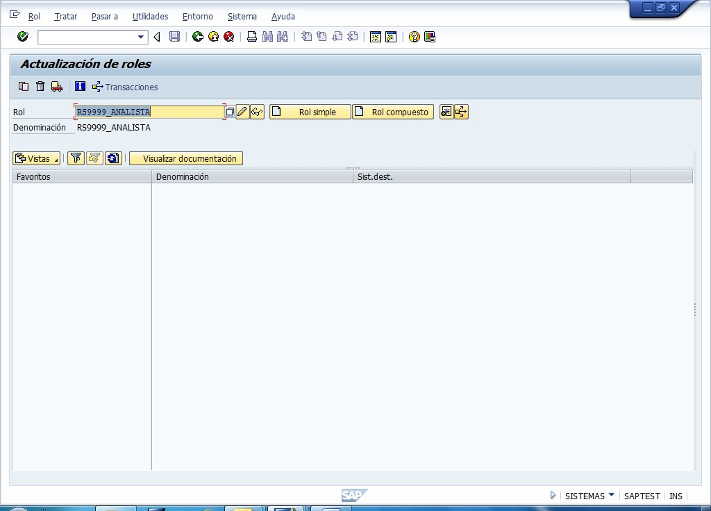
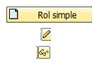

## **USUARIOS**

**Descripción breve del proceso:**

Permite crear roles simples y compuestos.

 

Crear, Modificar y Visualisar.

## Proceso paso a paso:

---

Solapas:

•	Descripción: Se asigna una descripción del Rol.

•	Menú: Se seleccionan las Transacciones de acceso que va a tener el Rol.

•	Autorizaciones: Desde esta solapa se pueden asignar manualmente los objetos de autorizacion faltantes y especificar niveles de organización. También desde aca se realiza la Grabación y Generación del Rol.

•	Usuario: No se asignan usuarios en el Rol Simple, ya que se hace desde el Rol Compuesto

Creación de Rol Compuesto:

Cada Puesto de trabajo está representado por un Rol Compuesto.

En esta transacción se puede 

Crear   
Modificar    
Visualizar   

Solapas:

•	Descripción: Se asigna una descripción del Rol.

•	Roles: se le asignan los roles simples que lo conformarán.

•	Menú: Al asignar los roles simples, automaticamente se agregan las transacciones correspondientes.

•	Usuario: Se asignan los usuarios que tendrán el Rol Compuesto (o Puesto de Trabajo). Una vez que se agregan o modifican los usuarios, hay que “comparar usuario”.

Transporte:

Se Ingresa el Rol Simple o Rol Compuesto y mediante el Botón   “Transportar Roles” se realiza el transporte.

	Transportar también los roles simples de los roles compuestos
	Transportar también los perfiles generados de los roles simples (con este tilde se transporta también la generación).

Ejecutar.

Selección de Objetos:

	Asignación de usuario
	Personalización 

Se selecciona la orden de transporte.

Desde la misma transacción se puede optar por Transportar en forma masiva, haciendo “Utilidades – Transportar en Masa”. Se puede realizar una selección múltiple de los roles a transportar.

Administración de Usuarios

* Transacción SU01

Alta/ Baja/ Modificación
Los usuarios no se transportan. Se crean previamente en cada mandante.

Solapa Roles:
En esta solapa se pueden ver los roles simples y los roles compuestos.
Desde aquí se le puede dar validez a los roles compuestos modificando la fecha de periodo de validez “desde – hasta”. Por ejemplo se le puede asignar un puesto de trabajo (rol compuesto) por un tiempo estipulado.

Solapa Parámetros: los parámetros y sus valores se asignan desde la transacción SU3. Para saber el ID de un parámetro, desde un campo determinado se hace “F1 – F9” (info técnica) y se saca el ID del parámetro.

* Matriz	

Con los cambios realizados actualizar la matriz.

Solapas de la Matriz:

Rol – Tx: en esta solapa se puede buscar una transacción en cuestión. Ya sea para ver si ya esta otorgada y a que Rol Simple y de ahí ver a que Rol Simple (Función) pertenece dicha transacción; o bien para ver si es una transacción faltante.

Rol Compuesto – Rol Simple: en esta solapa se va con el Rol Simple y se buscan los puestos que están involucrados.

Rol Simple – Usuario: en esta solapa se ven los puestos asignados a cada Rol Simple (Función)

## Documentación Técnica
