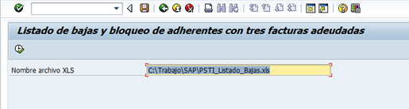
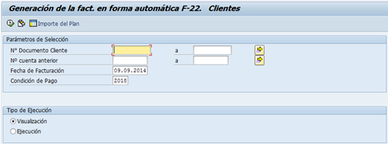
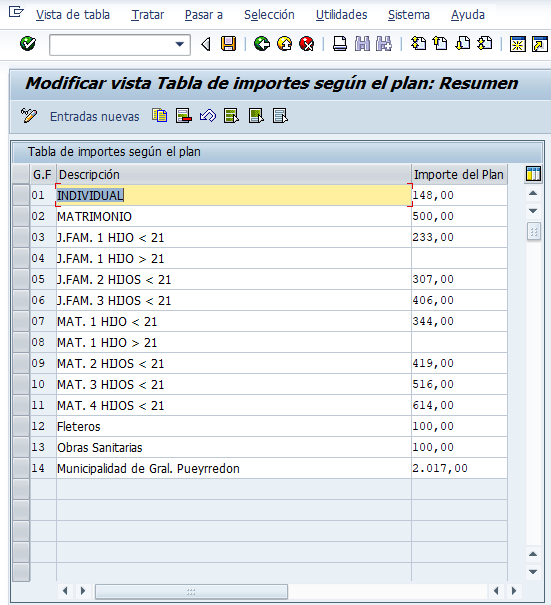
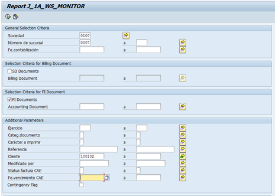

## **PSTI: Facturacion Adherentes**

**Descripción breve del proceso:**

Emision , Impresion y envio de facturacion.

Proceso paso a paso:

1. Listado de Bajas: Trx. ZFI_BAJAS. Se informan los adherentes con 2 o más facturas vencidas. En el caso que sean 2, solo informa en el listado y en el caso que sean 3 además de informar realiza el bloqueo de dicho adherente.

2. ZFI_ADHERENTE_FACT **– FACTURACION AUTOMATICA:                                                        **Una vez confirmado los clientes a facturar con menos de 3 meses de deuda, debemos ejecutar la trx.zfi_adherente_fact.

3. Importe de Plan: Permite ingresar el valor a facturar dependiendo del tipo de plan que posee el adherente.                

4. Numero Documento Cliente permite ingresar los adherentes a facturar. Numero de Cuenta Anterior: Es el numero utilizado en el sistema anterio de facturacion ""NO SAP"".  Fecha de Facturacion: ingresar fecha de facturacion. Condicion de Pago: Z018 ""Fija"". Tipo de Ejecucion: Visualizacion, permite visualizar importe y datos del adherente a facturar. Ejecucion, se realiza la facturacion.

5. Factura Manual: Permite Facturar en forma manual a un adherente. En
   caso de encontrarse un error en la facturación Automática, debemos facturar en
   forma manual.

6. **J1AMONITOR (ENVIO DE FACTURAS A AFIP PARA INGRESAR CAE A LA MISMA):** Permite enviar la facturacion generada a AFIP. 

**Sociedad:** 0100

**Numero de sucursal:**
0007

7. **ZFI_ADH_MAIL**

**(ENVIO DE MAIL E IMPRESIÓN DE FACTURA)**

La trx. zfi_adh_mail permite el envió
de mail a los adherentes que poseen el mismo cargado o bien imprimir la factura
a los que no lo poseen.

## **Casos / Preguntas frecuentes**

Caso 1:

Caso 2:

---

## Documentación Técnica
