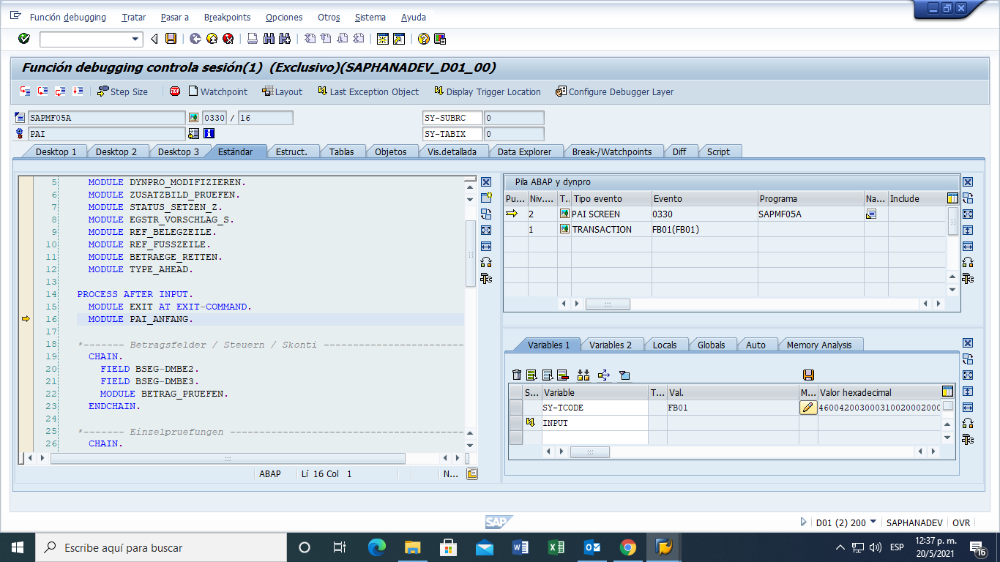
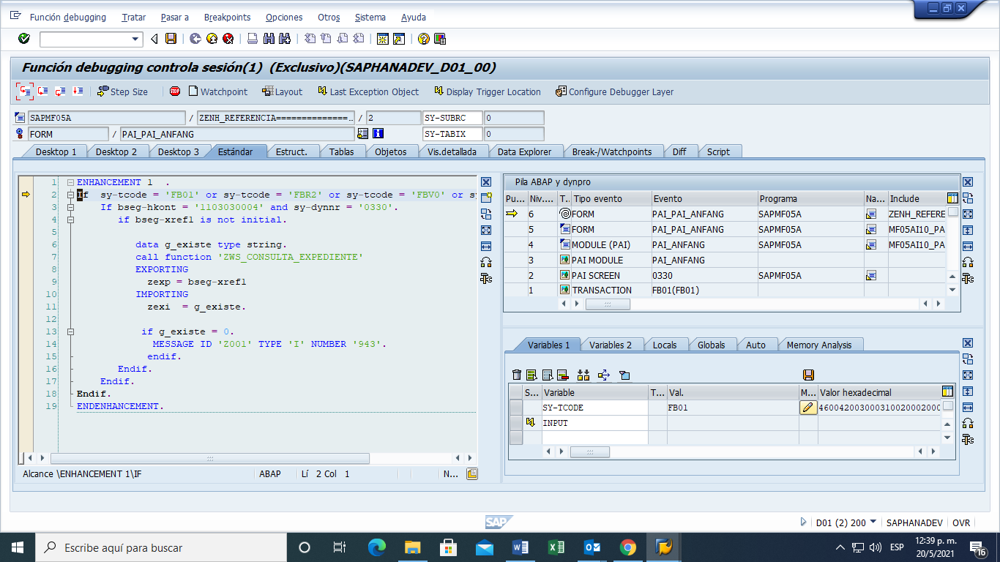

# Tecnología de la Información
## Documento Conceptual

**Título:** Validacion Expediente Ape via WS

**Área de aplicación:**	FI

**Fecha:** 31/05/2021

**Dirigida a:**	

**CC.**	

**Confeccionada por:** Leonardo Ruseff

***

# Objetivo
Insertar un WS en una transaccion standard de SAP 
Validar el ingreso de un Numero de expediente contra el Centro Autorizador

# Especificacion
SE80
SM59
Field_EXIT
SE37 Zexpediente

