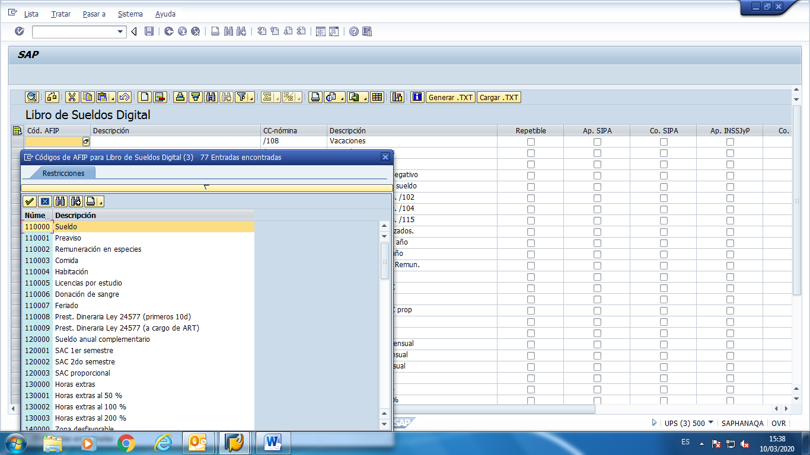

# Libro de Sueldos Digital

Descripcion breve del proceso:

Esta funcionalidad será utilizada para completar las nóminas
equivalentes de la AFIP con las que estamos utilizando en SAP, como así también
tildar para cada nómina el casillero que corresponda de los distintos conceptos.
Una vez subida y conformada esta información con la AFIP se está habilitada para
utilizar el LSD.

En base a la tarea detallada anteriormente se deberá cargar en
forma mensual la liquidación de los sueldos en la AFIP.

---

---

## Proceso paso a paso:


**Metodologia** 

**Generar**

Transacción  :   PC00_M29_CLSD

Datos a integrar:

Código de la
AFIP para LSD: se seleccionará el equivalente del mismo para el detalle de la

Código nómina
de SAP que  figura en la pantalla y de
deberá tildar los  casilleros que correspondan de los distintos conceptos.

El sistema muestra lasiguiente pantalla:




* **Armado del Txt**
*

### Casos / Preguntas frecuentes

No existen casos a la fecha

---

---

## Documentacion Técnica

**En SAP:**

* TRANSACCION: PC00_M29_CDTA - Transferencia Total de la remuneracion
* TRANSACCION: PC00_M29_CDTB - Transferencia anticipio de la remuneracion
* TRANSACCION: PC00_M29_FFOT - Armado del txt

Los programas de transferencias generan un registro en la tabla REGUH , en este registro se incluyen datos como fecha de transferencia , código de característica ( número de generación ) y código de banco propio desde donde va a salir el dinero , datos del banco del empleado e importe a pagar.
EL programa del armado del txt para el banco , selecciona según fecha , característica , código de banco propio y formato ( esto según el banco propio lo podemos deducir )  , con eso genera el archivo correspondiente

* TRANSACCION: PC00_M29_CDTA

  Datos a ingresar:

  ```
    Area de nomina 
    Periodo de pago
    Seleccion de numeros de legajos
    Fecha de ejecucion requerida de transferencia
  ```
* TRANSACCION: PC00_M29_FFOT

  Datos a ingresar:

  ```
    Fecha
    Codigo de caracteristica ( generado en proceso anterior)
    Elegir variante segun transferencia a realizar
    Descargar el txt generado
  ```
